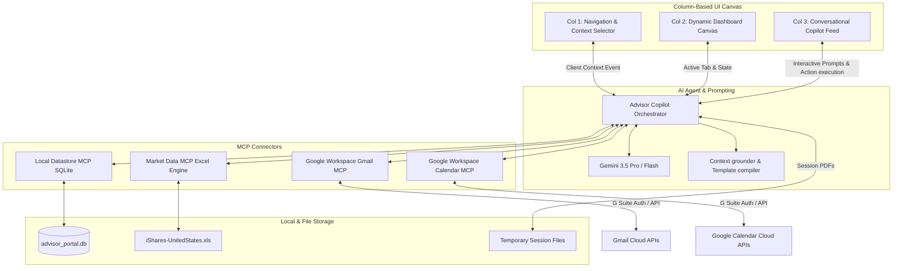
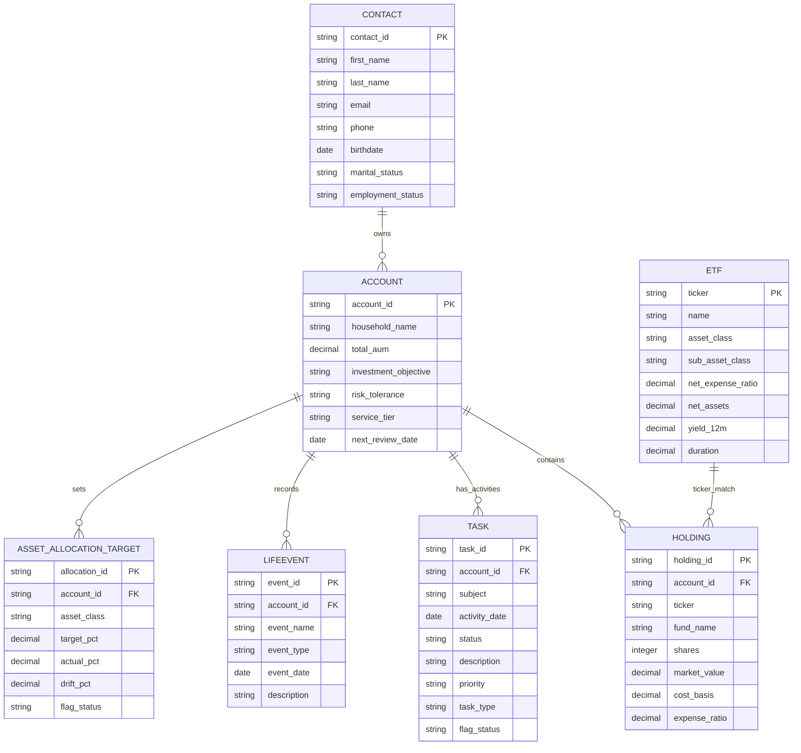

# MVP Design Specification: Advisor AI Copilot Portal

This document defines the Product, UX/UI, and Systems Architecture for the Advisory Dashboard Portal MVP. It serves as the definitive technical and design reference for the solution, enabling the engineering and design teams to build, validate, and scale the Advisor AI Copilot.

---

## 1. Product Vision & MVP Objectives

### Product Vision
To establish an **AI-First Unified Workspace** that acts as an active digital partner for wealth advisors. By embedding a context-aware conversational agent alongside structured financial dashboards, the system unifies CRM records, custodian data, financial planning targets, and Google Workspace applications into a single, cohesive interface. The Copilot proactively identifies practice opportunities, handles administration, and automates document workflows, enabling advisors to focus on deepening client relationships and expanding their business.

### MVP Objectives
*   **Time Reclaimed:** Reclaim **8 to 12 hours per week** per advisor on manual pre-meeting preparation, document reading, email drafting, and rebalancing analyses.
*   **Proactive Opportunity Spotting:** Transition the advisor from a reactive searcher to a proactive manager by surfacing high-priority red and yellow flags (asset allocation drifts, cash drag, compliance lapses).
*   **Zero-Swivel Integration:** Integrate email, calendar, and task management directly into the dashboard using the Google Workspace Gmail/Calendar MCP, eliminating the need to pivot between browser tabs.
*   **Trusted Human-in-the-Loop:** Design all compliance and outreach outputs as editable drafts, ensuring absolute regulatory compliance and advisor control over client communications.

---

## 2. Target User Personas

### Primary Persona: Sarah Mitchell, CFP®
*   **Role:** Senior Wealth Advisor & Practice Lead
*   **Context:** Manages 130 client households representing $180M in AUM. Conducts 6–10 client reviews per week.
*   **Bottlenecks:**
    *   Administrative overhead: Spends 45 minutes preparing for each client meeting by opening Salesforce, custodian portals, planning software, and Outlook.
    *   Communication delays: Spends hours drafting personalized review summaries, follow-up emails, and rebalancing rationales.
    *   Compliance stress: Fumbles to document suitability rationales in the CRM, creating audit vulnerabilities.
*   **UX Needs:** High scannability, context-linked AI suggestions, low-friction calendar booking, and "draft-first" email outreach.

### Secondary Persona: Marcus Vance
*   **Role:** Associate Advisor & Paraplanner
*   **Context:** Supports Sarah with plan building, data entry, custodian paperwork, and initial compliance drafting.
*   **Bottlenecks:**
    *   Copying and pasting plan metrics from MoneyGuide or eMoney PDF reports into internal dossiers.
    *   Structuring formal suitability memos from raw meeting transcripts.
*   **UX Needs:** Bulk plan PDF uploading, quick export controls (TXT/Word), and clear template scaffolding.

---

## 3. System Architecture & Solution Framework

The Advisor AI Copilot Portal uses a **Multi-Tier Agentic Architecture**. It separates the presentation layer, the data caching layer, the local calculation framework, and the external integration layers.



### Component Breakdown
1.  **Presentation Layer (Tri-Column UI):** React/Vite web interface that hosts navigation, canvas widgets, and the AI chat sidebar.
2.  **Orchestration Layer (Agent Engine):** Manages conversational state, compiles prompt context with database records, coordinates RAG retrievals, and converts natural language intents into system calls.
3.  **MCP Integration Layer (Protocol Connectors):** Utilizes Model Context Protocol (MCP) to provide structured schema interfaces to the local SQLite database, Excel file readers, and Google Workspace (Gmail and Calendar).
4.  **Local Data Layer (Grounding Databases):** Holds cached Salesforce CRM objects, Schwab custodian positions, parsed ETF market data from the iShares sheet, and text compliance templates.

---

## 4. Information Architecture & Layout Specifications

The workspace implements a **Tri-Column Layout** with bi-directional update loops to allow the chat interface to modify the visual dashboard, and vice versa.

```
+---------------------------------------------------------------------------------------------------------+
|                                           TOP GLOBAL CONTEXT RIBBON                                     |
+----------------------+--------------------------------------------------+-------------------------------+
|                      |                                                  |                               |
|   COLUMN 1           |   COLUMN 2                                       |   COLUMN 3                    |
|   Navigation &       |   Dynamic Dashboard Canvas                       |   Conversational AI Copilot   |
|   Client Selector    |   (Charts, grids, data tables)                   |   (Chat console & alerts)     |
|                      |                                                  |                               |
|   - Global Search    |   - Dashboard Home (Book View)                   |   - Proactive Alert Stream    |
|   - Core Links       |   - Client Dossier (Client View)                 |   - Contextual Quick Chips    |
|   - Upcoming Reviews |   - Portfolio Allocation & Performance           |   - Conversation Thread       |
|   - Settings         |   - Plan Gap tracker                             |   - Action Buttons            |
|                      |   - Document Vault / PDF Dropzone                |   - Voice Dictation           |
|                      |                                                  |                               |
|   Width: 240px       |   Width: Flexible (Flex-grow: 1)                 |   Width: 380px                |
|                      |                                                  |                               |
+----------------------+--------------------------------------------------+-------------------------------+
```

### Layout Specifications
*   **Column 1 (Navigation & Contacts):** Fixed `240px` width. Background: `#F3F4F1`. Holds search bar, navigation nodes, and a list of upcoming meetings.
*   **Column 2 (Dynamic Workspace Canvas):** Flex-grow canvas. Background: `#FAFAF7`. Handles structural display of tabular data, asset allocation charts, and document uploads.
*   **Column 3 (Conversational Copilot Sidebar):** Fixed `380px` width. Background: `#FFFFFF`. Shadow: `0 4px 12px rgba(28,43,58,0.08)`. Features scrolling chat history, voice recording toggle, file upload attachment pin, and action links.

### Bi-Directional Synchronization Logic
*   **Canvas-to-Agent Context Sync:** When the advisor selects a client in Column 1 or navigates to a tab (e.g. "Plan Gaps") in Column 2, the UI emits a `CONTEXT_CHANGE` event. The Copilot sidebar (Column 3) intercepts this event, loads the client's records in its memory context, updates its UI title (e.g., "COPILOT: CHEN HOUSEHOLD"), and presents client-specific Quick Action chips.
*   **Agent-to-Canvas Action Execution:** When the advisor asks the Copilot: "Show me the allocation drift," or clicks the `[Review Drift]` chip, the Copilot responds textually and appends a `NAVIGATE_TO` command. The dashboard wrapper captures the command and automatically switches the active Column 2 tab to "Asset Allocation", highlighting the drifted sectors.

---

## 5. System Data Model & Schemas

The local database (`advisor_portal.db`) is structured to mimic Salesforce FSC and Custodian tables, grounded with specific red and yellow flags for the Chen household.

### Entity Relationship Diagram (ERD)



---

## 6. Smart Advisory Alerts & Flag Indicators

The seeding framework sets up 4 specific red and yellow flags for the Robert & Patricia Chen household (Total AUM: $1.8M).

### Alert 1: High Cash Drag (Drift Alert)
*   **Severity:** **RED FLAG**
*   **Condition:** Cash holdings exceed target allocation by more than 10.0%.
*   **Database Grounding:** Target Cash allocation is 5.0% ($90k). Actual Cash is 50.0% ($900k), causing a **+45.0% positive drift ($810k excess cash)**.
*   **Trigger:** Displayed as a primary red badge on the Client Dashboard and home alert cards.
*   **Agent Recommendation:** "Reallocate $810,000 of excess cash to align with the Moderate target model. Recommended placement: SGOV for immediate 5.15% short-term yield, and IVV/AGG to rebuild core equity/bond targets."

### Alert 2: Asset Allocation Underweight (Style Drift Alert)
*   **Severity:** **RED FLAG**
*   **Condition:** Core equity or bond class is underweight by more than 10.0%.
*   **Database Grounding:**
    *   *Equity:* Target 65.0% | Actual 35.0% | **Drift: -30.0% (Underweight)**
    *   *Fixed Income:* Target 30.0% | Actual 15.0% | **Drift: -15.0% (Underweight)**
*   **Trigger:** Allocation pie charts display a red warning outline.
*   **Agent Recommendation:** "Rebalance portfolio by redeploying $540,000 from cash into US Equity (IVV) and $270,000 into Core Fixed Income (AGG) to restore target parameters."

### Alert 3: Compliance KYC Review Overdue
*   **Severity:** **YELLOW FLAG**
*   **Condition:** KYC review task age exceeds 365 days.
*   **Database Grounding:** Task `TSK_001` ("Overdue KYC Document Review") is marked `Overdue` with a deadline of `2026-06-15` (overdue by 45+ days).
*   **Trigger:** Warning icon next to the client contact card and on the daily task list.
*   **Agent Recommendation:** "Overdue KYC Document Review must be completed to comply with regulatory standards. Click `[Draft Client KYC Request]` to compose an email asking Robert for updated profile details."

### Alert 4: Expense Ratio Optimization (Fee Drag Alert)
*   **Severity:** **YELLOW FLAG**
*   **Condition:** Client holds active mutual fund with an expense ratio exceeding 0.50% when low-cost passive alternatives are available.
*   **Database Grounding:** Holding `HLD_009` is `ACT_BND` (Active Bond Fund) with an **expense ratio of 0.85% ($90k market value)**. Passive Core Bond `AGG` has an expense ratio of 0.03%.
*   **Trigger:** Yield optimizer tab displays an exchange recommendation.
*   **Agent Recommendation:** "Swap Active Yield Bond Fund (expense ratio 0.85%) for iShares Core Bond ETF (AGG, expense ratio 0.03%). Reallocating the $90,000 holding will save the client $738 annually in fee drag."

---

## 7. Google Workspace Gmail & Calendar MCP Integration

The Advisor Portal integrates with Google Workspace APIs via the Model Context Protocol.

### MCP Configuration Schema
```json
{
  "mcpServers": {
    "google-workspace": {
      "command": "npx",
      "args": ["-y", "@modelcontextprotocol/server-google-workspace"],
      "env": {
        "GOOGLE_CLIENT_ID": "YOUR_CLIENT_ID",
        "GOOGLE_CLIENT_SECRET": "YOUR_CLIENT_SECRET",
        "GOOGLE_REFRESH_TOKEN": "YOUR_REFRESH_TOKEN"
      }
    }
  }
}
```

### Bi-Directional Gmail Synchronization Patterns

#### 1. Incoming Calendar Sync to Column 2
*   **Behavior:** The center canvas's "Today's Schedule" widget retrieves the advisor's calendar events using `calendar_list_events` for the current date range.
*   **Context Linking:** When Sarah clicks the "10:00 AM - Robert & Patricia Chen (Annual Review)" calendar widget, Column 2 transitions to the Chen household profile, and the Copilot sidebar (Column 3) reads the event description and past meeting notes to pre-populate relevant quick action chips.

#### 2. AI Assistant Meeting Scheduling (Column 3)
*   **Behavior:** The advisor speaks or types: "Schedule a follow-up review with Robert next Tuesday at 2 PM."
*   **MCP Execution:**
    1.  The Copilot calls `get_calendar_free_busy` to check Sarah's availability.
    2.  If free, it calls `calendar_create_event` to insert the meeting event:
        *   `summary`: "Follow-up Wealth Review — Chen Household"
        *   `start_time`: `2026-08-18T14:00:00`
        *   `attendees`: `["robert.chen@email.com"]`
    3.  The calendar widget in Column 2 refreshes in real-time to show the newly scheduled event.

#### 3. Outgoing Email Drafting & In-Inbox Saving
*   **Behavior:** The advisor clicks `[Send Follow-up Draft]` in the Copilot pane.
*   **MCP Execution:** The Copilot generates the message content and calls `gmail_create_draft(to="robert.chen@email.com", subject="Follow-Up from Our Wealth Review", body=draft_text)`.
*   **Verification:** A notification toast appears: "Draft created successfully in Gmail." Sarah opens her standard Gmail account (or clicks a shortcut in the dashboard) to find the email pre-populated in her drafts folder, ready for final review and sending.

---

## 8. Conversational AI Assistant Capabilities & Workflows

For the MVP, the AI Assistant is granted the ability to perform direct calculations and text drafting, backed by reference templates and local database records.

### A. Jargon Explainer & Compliance Terms Simplifier
*   **Trigger:** Advisor or client (in client-facing mode) highlights a complex term or asks: "What does duration mean for AGG?"
*   **Workflow:** The Copilot intercepts the term, parses the definition, and outputs a simple, plain-language description:
    *   *Prompt:* "Explain Duration for a moderate risk client holding AGG."
    *   *Output:* "Duration is a measure of how sensitive your bonds are to interest rate changes. For AGG, the duration is 6.2 years. This means if interest rates rise by 1%, the bond fund's value is expected to drop by about 6.2%."
*   **Mapped Terms:** RMD (Required Minimum Distribution), OAS (Option Adjusted Spread), Yield to Maturity (YTM), expense ratio, drift, rebalancing.

### B. Dynamic Calculation & Reference Checking
*   **Trigger:** Advisor asks: "If we harvest the loss on AGG, how much tax savings do we get?"
*   **Calculation Engine:**
    *   *Input holding details:* AGG market value: $100,000 | Cost basis: $108,000 | **Realized loss: -$8,000**
    *   *Reference framework:* Ordinary income tax rate: 35.0% | Capital gains rate: 15.0%.
    *   *AI calculation:* Puts capital loss offset at $8,000. Offsetting capital gains saves **$1,200 ($8,000 * 15%)**. Offsetting ordinary income (up to $3,000 limit) saves **$1,050 ($3,000 * 35%)**.
    *   *Reference Output:* The Copilot presents the math breakdown and cites the underlying formulas (e.g., `realized_loss = market_value - cost_basis`; `tax_savings = loss * tax_rate`) to allow verification.

---

## 9. Compliance Document & Memo Assembly Framework

Compliance documents are compiled from modular `.txt` memo components stored in the filesystem.

### Hierarchy
`Document (COMP_DOC_001)` ➔ `Chapters` ➔ `Sections` ➔ `Memos (MEMO_SUIT_001 / MEMO_TRAD_001)`

```
+-------------------------------------------------------------------------------+
| COMP_DOC_001: Compliance Review and Suitability Document                       |
|                                                                               |
|   +-----------------------------------------------------------------------+   |
|   | SECTION 1: Portfolio Allocation and Suitability                       |   |
|   |                                                                       |   |
|   |   [MEMO_SUIT_001: Suitability Memo]                                   |   |
|   |   "Client risk profile is categorized as Moderate. Investment        |   |
|   |   objective is Growth & Income. Time horizon is 7 years..."            |   |
|   |                                                                       |   |
|   +-----------------------------------------------------------------------+   |
|                                                                               |
|   +-----------------------------------------------------------------------+   |
|   | SECTION 2: Transaction Summary and Trade Rationale                    |   |
|   |                                                                       |   |
|   |   [MEMO_TRAD_001: Trade Rationale Memo]                               |   |
|   |   "Trades triggered by cash drag adjustment. Allocation drifted by     |   |
|   |   35.0%, violating target variance bandwidth. Reallocated $630k..."  |   |
|   +-----------------------------------------------------------------------+   |
|                                                                               |
+-------------------------------------------------------------------------------+
```

---

## 10. End-to-End User Journeys & Demo Scenarios

### Scenario 1: The Morning Book Review (Research Alert to Email Draft)
1.  **Alert:** Sarah Mitchell opens the home dashboard. The Research Digest card shows: *"SGOV net expense ratio is 0.09%; yield is 5.15%."* Alongside, a red flag warns: *"Chen Household has 50.0% Cash ($900,000). Target is 5.0%."*
2.  **Interaction:** Sarah clicks `[Draft Cash Allocation Proposal]` on the SGOV card.
3.  **Calculation:** The Copilot calculates: "Moving $810,000 from cash (0% yield) to SGOV (5.15% yield) generates **$41,715 in annual interest**."
4.  **Gmail Integration:** The Copilot creates a draft email in Sarah's inbox:
    *   *To:* robert.chen@email.com
    *   *Subject:* Wealth Review: Reallocating Idle Cash to Reclaim Yield
    *   *Body:* Proposes the reallocation of $810,000 of cash to SGOV and core funds to generate interest.
5.  **Bi-directional Sync:** The task timeline in Column 2 updates to show: "Email draft created for cash drag reallocation."

### Scenario 2: Live Meeting Q&A and Suitability Logging
1.  **Meeting prep:** Sarah sits with Robert Chen. The Calendar widget displays the active meeting. Sarah clicks the calendar block; Column 2 loads Robert's dossier.
2.  **Q&A Discussion:** Robert asks: "What if we delay retirement from 65 to 67?"
3.  **Execution:** Sarah types the query into Column 3. The Copilot outputs a calculation comparison showing the funded ratio rising from 82% to 94% due to extra compounding and shorter distribution period.
4.  **Compliance memo:** Robert says: "Let's proceed with reallocating the $810,000 cash." Sarah clicks `[Draft Compliance Memo]`.
5.  **Assembly:** The Copilot reads the template configuration, pulls values from the SQLite DB, and populates `COMP_DOC_001`, nesting the suitability and trade rationale memos. It outputs the formatted document draft in Column 3.
6.  **Action:** Sarah clicks `[Record & Sync]`. The parsed document text is stored in the account activities table, and a PDF generation trigger is logged, syncing details to the Column 2 Document Vault view.
